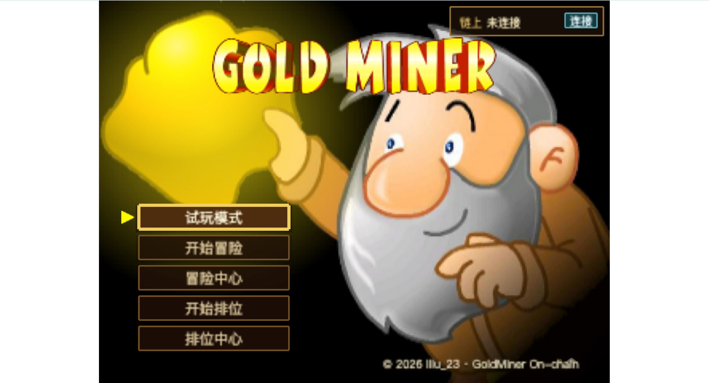
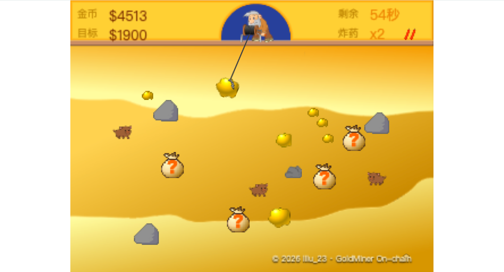
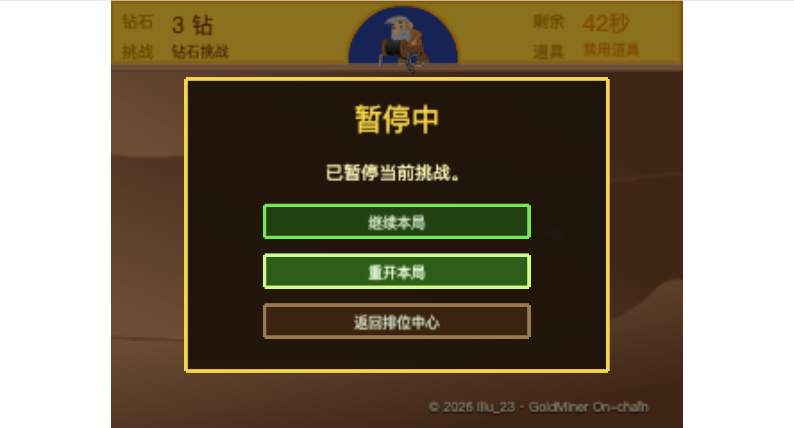
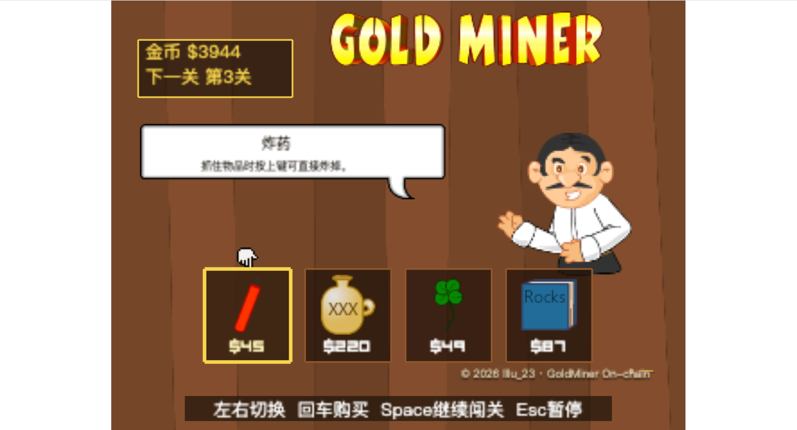
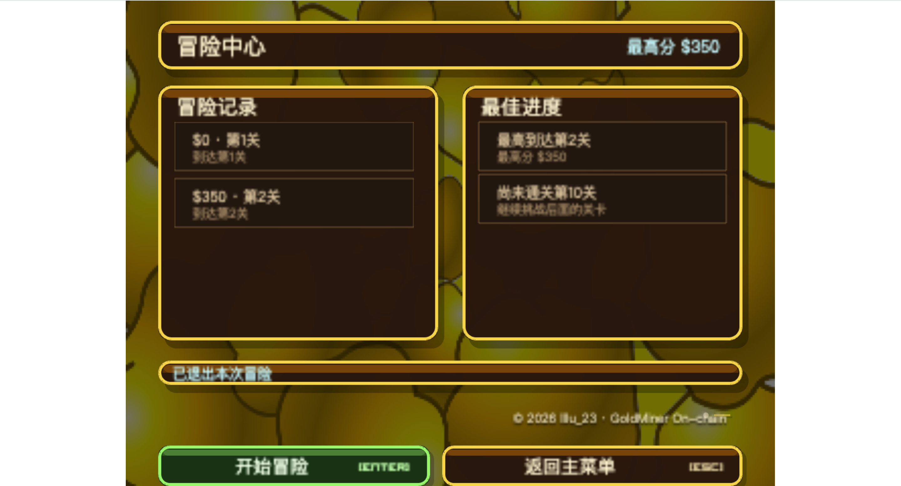
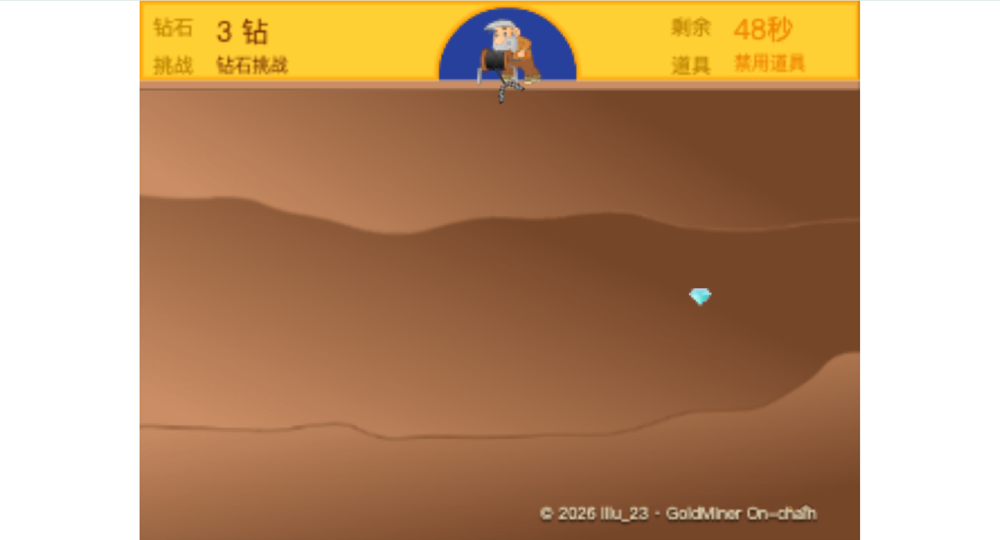
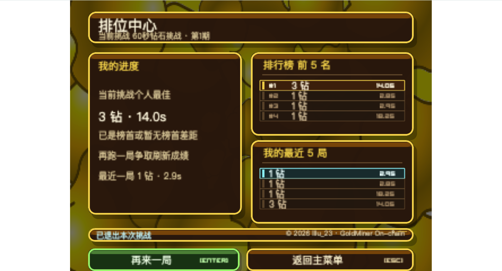

English | [简体中文](./README.md)

# GoldMiner On-chain

A local-first `Phaser + Rust + Solidity` onchain game reference implementation.

## TL;DR

- Fastest way to run it: use `make dev`. The default local chain is `31337`, and the frontend usually starts at `http://localhost:5173`.
- Fastest way to understand it: start with `Casual`, then move to `Adventure / Campaign`, and finish with the trusted `Ranked` path.
- The current public repository intentionally keeps only the bilingual README files as the main documentation surface.

## Positioning and boundaries

This repository combines a `Phaser` gameplay client, `Solidity` contracts, a
`Rust` verification API, and a local read model into one runnable teaching
project. It is best used as something you can study, demo, and extend, rather
than as a turnkey public production framework for a shared leaderboard game.

If this is your first time here, keep these three points in mind:

- This is a local-first onchain game reference implementation, not a hosted
  public service by default.
- You can run the full stack first, then understand the repository through the
  `Casual`, `Adventure`, and `Ranked` modes.
- This public GitHub version is intentionally slim, so the main project
  explanation is concentrated in the bilingual README files.

These boundaries are also worth knowing up front:

- The default target environment is `anvil@31337`.
- `Ranked` currently has the most complete trusted validation path.
- `Casual` and `Campaign` are not yet authoritative in the same way `Ranked`
  is.
- A self-hosted local stack does not provide strong anti-cheat guarantees.

## Screenshots

These screenshots cover the main gameplay surfaces in the repository. Each one
is shown as a separate business scene so you can build a visual map of the
project before you read code or expand the documentation further.

### Home and entry flow

**Main menu**

This is the top-level entry screen. From here you can enter casual mode,
adventure mode, ranked mode, and see the wallet status area in the top-right
corner.



### Adventure mode

**Adventure goal briefing**

Before a run starts, adventure mode shows a goal briefing screen. This is where
the current level target, progression, and continue prompt are introduced.


**Adventure gameplay**

This is the core adventure gameplay screen. The player completes the main loop
here: grabbing, meeting the target, using items, and advancing the run.



**Adventure pause menu**

When the player pauses the run, the game enters the pause menu. From here they
can resume, restart the current run, or leave the current adventure flow.



**Adventure shop**

Between levels, the run moves into the shop. The player can buy dynamite or
temporary buffs here and carry those results into the next level.



**Adventure center**

The adventure center is the hub for the wallet-connected multi-level flow. It
holds the main adventure entry action and the history/progression summary.



### Ranked mode

**Ranked gameplay**

This is the core ranked gameplay screen. It maps to the trusted
single-challenge validation flow and is currently the most complete
authoritative gameplay path in the project.



**Ranked center**

The ranked center is the main ranked entry page. It is where challenge entry,
leaderboard-oriented information, and ranked flow status are surfaced.



## Get running in 5 minutes

If you already have the required tools installed, the fastest path is a single
command:

```bash
make dev
```

It will, in order:

1. Start or restart local `Anvil`
2. Deploy contracts and sync runtime config
3. Start the `Rust API`
4. Launch the frontend dev server

### Requirements

- Node.js and npm
- Rust toolchain and Cargo
- Foundry, including `forge` and `anvil`

### What you should see

- The frontend dev server usually starts at `http://localhost:5173`
- The local chain uses `31337`
- The Rust API usually runs at `http://127.0.0.1:8788/api`

### Minimum validation steps

After the stack is up, use this quick validation path:

1. Open the home screen and confirm that you can enter casual mode.
2. Play one casual run and confirm the local gameplay loop works.
3. Connect a wallet, then enter ranked or adventure mode and confirm the wallet
   and service flow works.

If you want a repository-level check:

```bash
make test
```

That command covers contracts, backend, frontend, and a selected smoke test
path.

## Three gameplay modes

Before you dive into implementation details, separate the boundaries of the
three modes.

| Mode | Main goal | Onchain or not | What to focus on first |
| --- | --- | --- | --- |
| `Casual` | Pure local gameplay | No | Phaser scene flow, gameplay state, goal and result screens |
| `Adventure / Campaign` | Multi-level progression with local-first validation | Results sync | Multi-level runs, shop carry-over, session flow, campaign evidence |
| `Ranked` | Trusted single-challenge validation and leaderboard flow | Results sync | Replay evidence, Rust verifier, authoritative runtime |

## Gameplay flow and learning order

If you want to understand how this repository grows in complexity, the easiest
path is not “contracts first.” It is “gameplay first, then trust.”

1. `Casual`
   - Start with the pure local gameplay loop: `Goal -> Gameplay -> Shop -> Result`.
   - This is the best way to build a mental model for Phaser scenes, local game
     state, and the baseline UI flow.
2. `Adventure / Campaign`
   - Then add multi-level progression, shop carry-over, wallet connection,
     sessions, and campaign evidence.
   - This layer is the best place to understand why not everything goes onchain
     directly, and how the local-first validation flow works.
3. `Ranked`
   - Finally move into the trusted single-challenge path: replay evidence, the
     Rust verifier, the authoritative runtime, and leaderboard syncing.
   - This is currently the most complete trusted result pipeline in the
     repository.

If you only want the fastest learning path, treat “run it first -> understand
Casual -> move to Adventure -> finish with Ranked” as the default order.

## Repository structure

If you are about to read code, start by building a top-level map of these
directories.

| Directory | Purpose |
| --- | --- |
| `frontend/` | Phaser + TypeScript client, wallet UX, scenes, and E2E tests |
| `backend/` | Rust verification core and API services |
| `contracts/` | Solidity contracts plus Foundry deployment and test setup |
| `scripts/` | Manifest generation, contract sync, and local tooling scripts |
| `assets/` | Shared runtime game assets |

## Common commands

These are the commands you will use most often in local development.

| Command | Purpose |
| --- | --- |
| `make dev` | Start the full local stack |
| `make deploy` | Deploy contracts and sync local runtime config |
| `make api` | Start the Rust API in the foreground |
| `make web` | Start the frontend dev server |
| `make test` | Run contracts, backend, frontend, and selected smoke checks |
| `cd frontend && npm run test:e2e:smoke` | Run the selected browser smoke test |
| `cd frontend && npm run test:stability` | Run Playwright stability tests |

If you want a manual step-by-step boot flow instead:

```bash
make anvil
make deploy
make api
make web
```

## Key environment variables

The root README only keeps the small set of variables that matter most for
getting the local stack running. For the full list, go directly to
`.env.example`, `frontend/.env.example`, and `frontend/.env.local.example`.

| Variable | Purpose | Default / Example |
| --- | --- | --- |
| `RPC_URL` | Local chain RPC URL | `http://127.0.0.1:8545` |
| `CHAIN_ID` | Local chain ID | `31337` |
| `API_BASE_URL` | API base URL used by the frontend | `http://127.0.0.1:8788/api` |
| `PRIVATE_KEY` | Local deployer / relayer / verifier private key | Default Anvil key |
| `VITE_RUNTIME_CONFIG_PATH` | Frontend runtime config path | `/contract-config.json` |

## Public repository note

To keep the GitHub presentation more compact, this public repository version
keeps only the Chinese and English README files as the documentation entry
surface. If you want to expand it into a fuller open-source doc set later, you
can add more public documentation pages back in a future iteration.

## Author

This project is maintained and published by `lllu_23`.

- Author: `lllu_23`
- Contact email: `lllu238744@gmail.com`

## License

This repository is released under the [MIT License](LICENSE).
